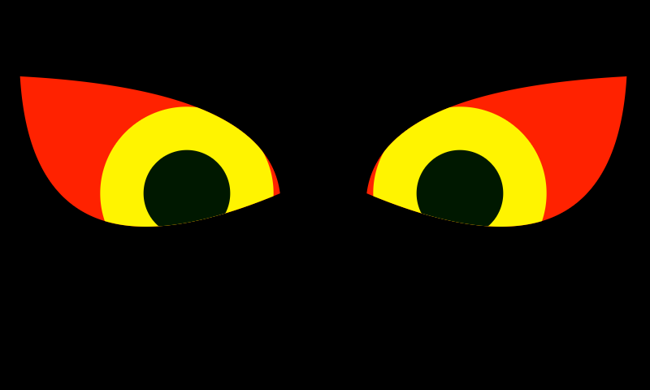
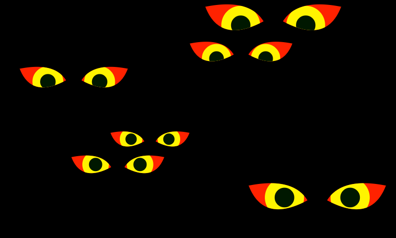

# Halloween Eyes

Scare up some serious fun with these spooky animated eyes. If your lucky, the kids might drop their loot and run. 

 

You will need an old Android tablet or phone. Go into the display settings. Set the brightness to a minimum, for maximum terror. Open the browser and go into settings there as well, to see if it's possible to hide the address bar. I found it under experimental/lab on Android 4.1.2. Otherwise, use electrical tape to obscure this portion of the screen. Also, you'll have to enable the option that says "do not suspend when browsing", so the device doesnt go to sleep.

Disclaimer: Don't leave a device outside in freezing weather, cause the LCD screen might get damaged. Rain is obviously also going to be a huge problem.

You can preview these files here:
- http://htmlpreview.github.io/?https://github.com/djabraham/halloweyes/blob/master/eyes-single.html
- http://htmlpreview.github.io/?https://github.com/djabraham/halloweyes/blob/master/eyes-multiple.html

### Credits
  I found some useful code techniques here:
  https://codepen.io/jackrugile/pen/fpADK?page=1&
  

